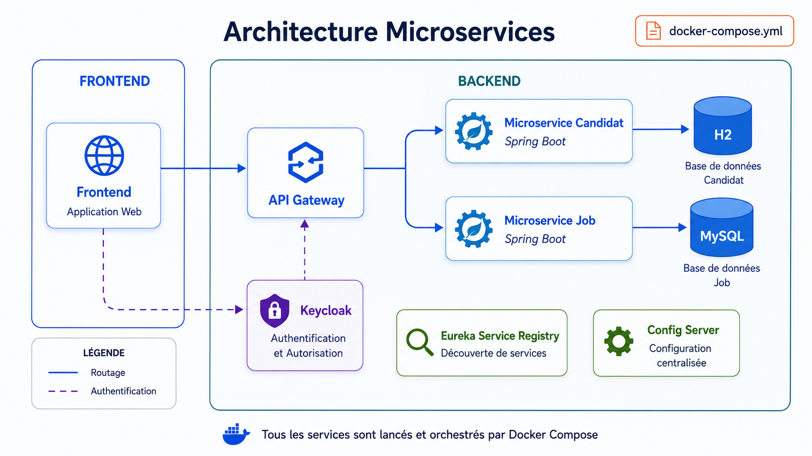

# Microservices Training

A structured training repository for learning and practicing Microservices Architecture.

This repository covers sessions 04, 05, and 06 of the Microservices training program.

---

## Training Sessions

| Session | Topic |
|---|---|
| 04 | Microservices Communication |
| 05 | Dockerisation & Containerisation |
| 06 | Security with Keycloak |

---

## Architecture



---

## Global Architecture

The global architecture is based on a distributed microservices system orchestrated with Docker Compose.

The application is composed of a frontend application, an API Gateway, multiple microservices, databases, service discovery, centralized configuration, and a security layer using Keycloak.

### Request Flow

1. The user accesses the application through the frontend.
2. The frontend sends requests to the API Gateway.
3. The API Gateway routes requests to the appropriate microservice.
4. Each microservice communicates with its own database.
5. Keycloak manages authentication and authorization.
6. Eureka Service Registry allows services to be discovered.
7. Config Server centralizes configuration for the microservices.

---

## Repository Structure

```text
microservices-training/
├── assets/
│   └── architecture-microservices.png
│
├── 04-microservices-communication/
│   ├── presentation/
│   ├── source-code/
│   └── workshop/
│
├── 05-dockerisation-containerisation/
│   ├── presentation/
│   ├── source-code/
│   └── workshop/
│
├── 06-keycloak-security/
│   ├── presentation/
│   ├── source-code/
│   └── workshop/
│
└── README.md
```

---

## Session Details

### 04 - Microservices Communication

This session covers communication between microservices, including synchronous and asynchronous communication.

**Main concepts:**

- REST communication
- OpenFeign
- RabbitMQ
- Producer and consumer
- Queue, exchange, and routing key

---

### 05 - Dockerisation & Containerisation

This session focuses on containerizing microservices and running the complete architecture using Docker and Docker Compose.

**Main concepts:**

- Dockerfile
- Docker image
- Docker container
- Docker Desktop
- Docker Compose
- Multi-container architecture

---

### 06 - Security with Keycloak

This session focuses on securing a microservices architecture using Keycloak.

**Main concepts:**

- Authentication
- Authorization
- OAuth2
- OpenID Connect
- JWT
- Realm, client, user, and role
- API Gateway security

---

## Objective

The objective of this training is to build a complete microservices architecture step by step, including:

- Communication between services
- Asynchronous messaging
- Containerization
- Service discovery
- Centralized configuration
- Security with Keycloak

---

## Author

**Ons Ben Amor**